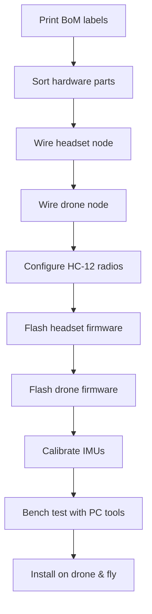

# ESP32 Head-Tracking Camera System

Welcome! This repository contains a complete, beginner-friendly build for a two-node ESP32 head-tracking camera stabilizer. The system lets a pilot wear a headset that senses head movement and keeps a camera on a drone pointed where the pilot looks, while compensating for the drone's own motion. The documentation assumes no prior electronics or programming experience and walks you through the entire afternoon build.

---

## 1. Project Snapshot

| Feature | Headset Node | Drone Node |
|---------|--------------|------------|
| MCU | ESP32-WROOM dev board | ESP32-WROOM dev board |
| IMU | MPU-6050 | MPU-6050 |
| Radio | HC-12 433 MHz (serial) | HC-12 433 MHz (serial) |
| IO | Recenter button, status LED | Pan servo, tilt servo, PWM input, status LED |
| Update Rate | ~30 packets per second | ~30 packets per second |
| Orientation Filter | Madgwick quaternion fusion | Madgwick quaternion fusion |

* **Modes:** Selected by a three-position switch on your Radiomaster transmitter through the F722 flight controller and into the drone ESP32.
* **Failsafe:** If the drone node misses packets for more than 150 ms, the camera smoothly recenters.
* **Servo Limits:** Pan and tilt movements are automatically limited to 120°/s and 90°/s to avoid mechanical stress.

---

## 2. Fast Start Checklist

1. **Print the label cards** from [`hardware/printable_label_cards.pdf`](hardware/printable_label_cards.pdf) and tape them to your parts bins.
2. **Order parts** using the Bill of Materials guide in [`hardware/bom.md`](hardware/bom.md). Run `make bom` to see total cost/weight breakdowns.
3. **Wire the headset** following [`docs/wiring_headset.md`](docs/wiring_headset.md). It includes large diagrams and plug-by-plug instructions.
4. **Wire the drone node** using [`docs/wiring_drone.md`](docs/wiring_drone.md) and the Betaflight integration notes in [`docs/betaflight_setup.md`](docs/betaflight_setup.md).
5. **Configure the HC-12 radios** with the AT commands listed in [`docs/hc12_config.md`](docs/hc12_config.md).
6. **Flash firmware** with PlatformIO:
   ```bash
   pio run -e headset_esp32 -t upload
   pio run -e drone_esp32 -t upload
   ```
7. **Calibrate the IMUs** using the motion routine described in [`docs/calibration.md`](docs/calibration.md).
8. **Verify operation** with the PC test tools in [`test/`](test/) and the checklist at [`test/selftest_checklist.md`](test/selftest_checklist.md).

If you follow the steps in order, you can go from unopened parts boxes to a working head-tracking gimbal in one afternoon.

---

## 3. Repository Map

```text
README.md                ← Start here for the big picture
/docs/                   ← Wiring, setup, theory, troubleshooting
/firmware/               ← PlatformIO projects for headset and drone
/hardware/               ← Bills of materials and part labels
/test/                   ← PC-side tools and validation checklists
/tools/                  ← Utility scripts (BoM aggregator)
Makefile                 ← Convenience commands (e.g., `make bom`)
```

Each subdirectory has its own README-style documentation so you never need to guess what a file does.

---

## 4. Required Skills & Tools

* **No coding experience needed.** Every sketch is pre-written, thoroughly commented, and ready to flash.
* **Tools:** Soldering iron, lead-free solder, wire strippers, small screwdrivers, multimeter, and a Windows/macOS/Linux PC with USB.
* **Software:** [Visual Studio Code](https://code.visualstudio.com/), [PlatformIO extension](https://platformio.org/install/ide?install=vscode), and [Python 3.9+](https://www.python.org/downloads/).

If you can assemble an RC kit and follow written instructions, you can complete this project.

---

## 5. Build Flow at a Glance



Each stage references the matching documentation so you always know where to look next.

---

## 6. Documentation Highlights

* [`docs/wiring_headset.md`](docs/wiring_headset.md) – Step-by-step harness build with photos (ASCII diagrams) and continuity checks.
* [`docs/wiring_drone.md`](docs/wiring_drone.md) – Drone node wiring, servo harness, and PWM input tapping.
* [`docs/betaflight_setup.md`](docs/betaflight_setup.md) – How to map the three-position switch to an AUX channel and output PWM to the ESP32.
* [`docs/hc12_config.md`](docs/hc12_config.md) – Exact AT commands to set baud, channel, power, and FU mode.
* [`docs/calibration.md`](docs/calibration.md) – IMU bias capture, six-point accelerometer routine, and gyro drift check.
* [`docs/theory.md`](docs/theory.md) – Plain-language explanation of quaternion math and how the compensation works.
* [`docs/troubleshooting.md`](docs/troubleshooting.md) – LED codes, serial console cues, and common mistakes.

---

## 7. Firmware Overview

Both ESP32 sketches share a common library (`firmware/common`) that includes:

* **`madgwick.*`:** Quaternion-based sensor fusion tuned for 200–500 Hz update.
* **`imu_mpu6050.*`:** Friendly wrapper around the MPU-6050 with detailed comments.
* **`packet.h`:** Defines the 9-byte radio packet with CRC-8 validation.
* **`servo_map.h`:** Helper functions to map angles to microseconds with soft limits.
* **`util.h`:** Timing helpers, LED blink routines, and CRC helpers.

The headset node measures its orientation and broadcasts yaw/pitch/roll every ~33 ms. The drone node combines the incoming head orientation with its own IMU data, compensates for drone motion, applies mode rules, and commands the pan/tilt servos while honoring slew limits and failsafes.

---

## 8. Testing & Visualization Tools

* [`test/loopback_headset_pc.py`](test/loopback_headset_pc.py) – Plots live headset orientation on a PC via USB.
* [`test/viz_drone_pc.py`](test/viz_drone_pc.py) – Visualizes drone orientation vs. commanded camera angles, perfect for bench testing.
* [`test/selftest_checklist.md`](test/selftest_checklist.md) – A printable checklist to verify the entire system before flight.

---

## 9. Support & Troubleshooting

The troubleshooting guide in [`docs/troubleshooting.md`](docs/troubleshooting.md) covers everything from "PlatformIO can't find my board" to "Servos jitter when motors spin." If you discover new edge cases, feel free to extend the guide and regenerate the BoM with `make bom`.

---

## 10. Contributing & Customizing

This repository is intentionally easy to adapt. You can:

* Swap in different servos by updating `servo_map.h` with new pulse ranges.
* Adjust radio channels or baud rates in `packet.h` and the HC-12 config doc.
* Add gimbal stabilization logic by editing `firmware/drone/main.cpp` (the comments walk you through every section).

After making changes:

1. Run `pio run` for both environments to ensure the firmware still compiles.
2. Execute `make bom` if you touched the hardware lists.
3. Update documentation so future builders benefit from your improvements.

---

## 11. License

All documentation and source code in this repository are released under the MIT License. This allows you to adapt the project for personal or commercial builds while keeping attribution intact.

Happy building, and clear skies!

